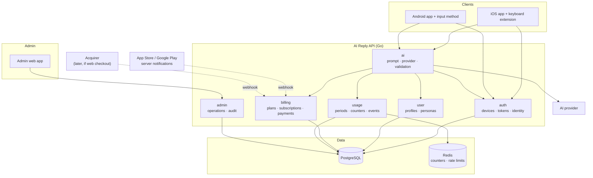
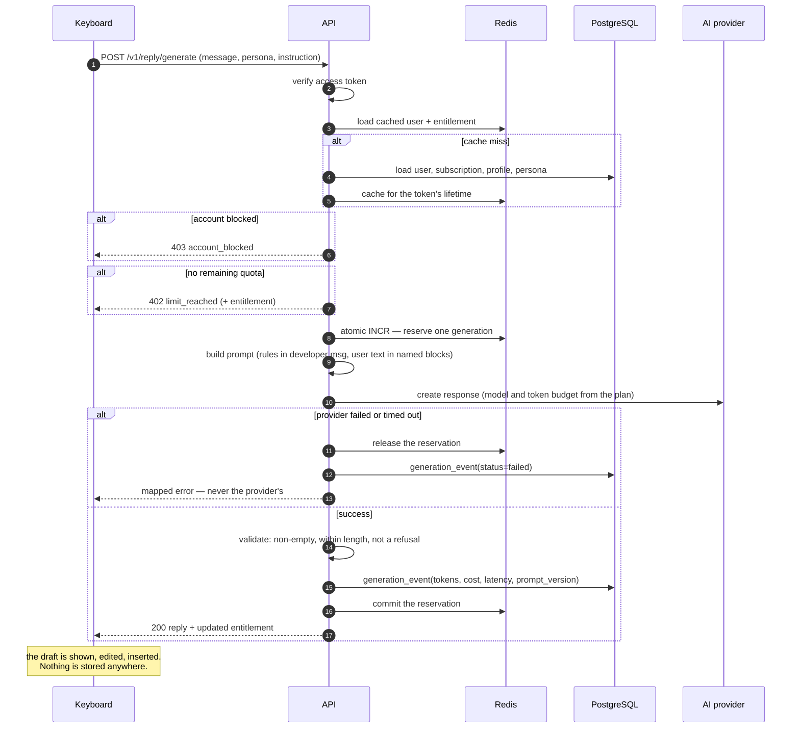
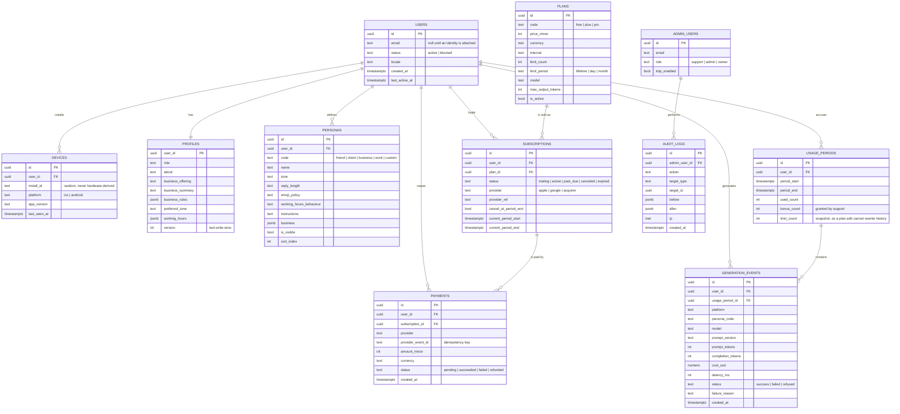

# AI Reply — production platform architecture

**Status: design only.** Nothing in this document is implemented. No backend, no
admin panel, no payment integration and no database exists. It describes where
AI Reply should go after the Android port, and — just as importantly — the order
in which to get there and what not to build yet.

---

## 1. Executive summary

AI Reply today is two client applications that each hold a user's OpenAI key and
call the provider directly. That works, it is honest about what it is, and it
cannot ship on a store. Every constraint below follows from one fact: **a
credential that reaches a device is a credential the device's owner can
extract.** Everything the product wants next — free trials, paid plans, usage
limits, cost control, knowing how many users there are — is impossible while the
client is the one holding the key, because a client can be edited.

The recommendation is a single backend service that owns the credential, the
user record, the entitlement decision and the usage counter, with mobile clients
that ask it for a reply and are told yes or no. That is one service, one
database, and roughly four endpoints for the MVP. It is deliberately small: the
temptation with a document this long is to build all of it, and the right first
increment is Phase 3 of §36 — nothing more.

Three decisions deserve to be settled before any code:

* **Go, not Node**, for the backend. The prototype in `AI-Reply/backend` is
  Express and works, but the team's production language is Go with PostgreSQL,
  Redis and OpenTelemetry, and an AI proxy is exactly the kind of
  latency-sensitive, concurrency-heavy service Go is good at. Rewriting ~600
  lines of prototype is cheap; operating a service in a language the team does
  not run in production is not.
* **Store billing, not an acquirer,** for the first paid release — see §25. This
  is the decision most likely to be got wrong, and getting it wrong means a
  rejected app.
* **Nothing is entitled by the client.** The phone may cache what it was told
  for UI, and must never decide.

---

## 2. Current iOS state

A two-target Xcode project: a SwiftUI app and a UIKit keyboard extension sharing
a `Shared/` source folder, joined by an App Group.

* **Storage** — profile and templates in a JSON file in the App Group container,
  mtime-cached; small flags in App Group `UserDefaults`; the OpenAI key in the
  Keychain (`AfterFirstUnlockThisDeviceOnly`, access group = the App Group).
* **AI** — `AIReplyService` validates, `ReplyPromptBuilder` assembles a developer
  message and a user message, and one of two `ReplyTransport`s makes the call.
* **Transports** — `DirectOpenAITransport` (device holds the key) and
  `BackendTransport` (a service holds it). Only the first is in real use.
* **Product model** — a `UserProfile` (role, about, business, tone, working
  hours) and a list of `ReplyTemplate`s (four built-ins plus custom), each with
  tone, length, emoji policy, per-template business facts and hours.
* **Languages** — en/ru/kk for the interface; reply language follows the incoming
  message.

There is also a prototype Node service in `AI-Reply/backend` — Express, an
in-memory rate limiter, a bearer token minted from a random install id. It is a
proof that `BackendTransport` works, not a production service: no database, no
users, no persistence, no entitlements.

**What is absent, and is the whole subject of this document:** there is no user.
Nobody has an account, nothing is counted, nothing can be sold, and nobody can
answer "how many people use this".

## 3. New Android state

A single-module Kotlin/Compose app containing both the UI and an
`InputMethodService`, with the iOS domain model, prompt builder, transports and
error set ported one-to-one. It adds a spoken instruction inside the keyboard,
which iOS cannot have. See `../README.md` and `IOS_ANDROID_PARITY.md`.

For this document, the relevant points are that both clients now:

* share a domain model and a wire format, so one service can serve both without
  branching on the caller;
* already have a `BackendTransport` that speaks the intended protocol;
* already hold a random per-install identifier, which is the seed of the first
  account.

## 4. iOS / Android feature parity

`IOS_ANDROID_PARITY.md` is the full matrix. The platform-relevant deltas:

| Concern | Consequence for the backend |
|---|---|
| Android sends a `user_instruction`; iOS does not | The field must be optional. A service that requires it breaks iOS |
| Android dictates inside the keyboard | If transcription moves server-side (§9), it is an Android-only endpoint at first |
| Both cap the incoming message at 300 characters | The server must enforce it too; a client-side limit is a UX affordance, not a control |
| Both send `keyboard_language` | Legacy name for the *app* language. Keep it; renaming a shipped field buys nothing |

## 5. Current AI integration

One call per generated reply, to `POST https://api.openai.com/v1/responses`:

| | |
|---|---|
| Model | `gpt-4o-mini` (client-configurable in direct mode) |
| Messages | a `developer` message holding the rules, a `user` message holding all user data in named blocks |
| `max_output_tokens` | 180 — sized so a Kazakh reply is not truncated |
| `temperature` | 0.7 |
| `store` | `false` — no server-side retention |
| Timeout | 25 s |
| Failure | mapped to a closed set of eleven errors; no status code or body ever reaches the UI |

Roughly 700–1100 input tokens and under 180 output tokens per reply. At
`gpt-4o-mini` list prices that is on the order of a hundredth of a cent per
reply, which matters less than the fact that it is **unbounded**: nothing today
stops one extracted key from serving a thousand people.

---

## 6. Target production architecture

```
iOS app + keyboard ─┐
                    ├─→  AI Reply API  ─→  PostgreSQL
Android app + kbd ──┘         │         ─→  Redis (counters, rate limits)
                              │         ─→  AI provider
Admin web app  ───────────────┘
```

One service, one database, one cache. Not microservices: the entire domain is
users, entitlements and a proxied call, and splitting that across services would
add failure modes and latency to solve a problem of scale the product does not
have and may never have.

**The backend is authoritative for** authentication, the user record, AI
credentials, the personalization it holds, limits, plans, subscriptions, payment
state, usage and every admin operation.

**The client is authoritative for** nothing that costs money. It renders, it
caches for offline UI, and it asks.

## 7. Mobile architecture

Both clients keep their current shape. The changes are confined:

* `AITransportMode` moves to `.backend` and the direct mode becomes a debug
  build flag, not a user setting.
* The key entry screen disappears. Settings gains an account section.
* A `SessionStore` holds an access token (short-lived) and a refresh token, in
  the Keychain / Android Keystore — never in preferences.
* A cached `Entitlement` (plan name, replies remaining, period end) drives the
  UI when offline. It is advisory: the keyboard shows "3 replies left today"
  from cache and still asks the server, which may disagree.
* One new error case, `limitReached`, joins the closed set — the only place the
  error set grows.

The keyboard's rule that generation starts only on an explicit tap becomes more
important, not less, once generations are metered.

## 8. Keyboard architecture

Unchanged by the backend, with two additions:

* **Show the balance where the decision is made.** Replies remaining belongs in
  the panel, not three screens away in the app.
* **A refusal is a first-class state.** "You have used your 7 free replies" with
  a button that opens the purchase screen — not a generic error toast. This is
  the single highest-leverage conversion surface in the product, and it is worth
  designing rather than inheriting from the error path.

## 9. Voice architecture

Android dictates on-device today, which is free, private and needs no backend.
It should stay the default.

Server-side transcription becomes worth building when Kazakh coverage proves
inadequate in the field — which is likely. The client abstraction
(`SpeechRecognitionClient`) already allows it: a `BackendTranscriptionClient`
posts audio to `POST /v1/voice/transcribe` and returns text.

Before building it, note what it costs: audio leaves the device. That is a
materially different privacy promise from the one the product makes today, and
it needs an explicit, per-user opt-in, a stated retention policy (delete after
transcription, no exceptions) and a line in the privacy policy. **Recommendation:
do not build it until on-device recognition has been measured and found wanting
for Kazakh specifically.**

## 10. Authentication

The tension: the product's appeal is that it asks for nothing. Requiring an
email before the first reply would hurt the funnel badly.

**Recommended: anonymous-first, with optional upgrade.**

1. On first launch the client posts its random install identifier to
   `POST /v1/auth/device`. The server creates a user and a device row and returns
   an access token (15 min) and a refresh token (long-lived, rotating).
2. The user gets their free replies without typing anything.
3. When they subscribe — or want their plan on a second device — they attach an
   identity: email with a one-time code, or Sign in with Apple / Google. The
   anonymous user is upgraded in place; nothing is lost.

Tokens: signed JWTs for access (so the hot path verifies without a database
round-trip), opaque rotating refresh tokens stored hashed. A refresh token
presented twice means it was stolen: revoke the family and force re-auth.

The install identifier is a weak identity — reinstalling produces a new one. That
is acceptable for a 7-reply trial and not acceptable as abuse control on its
own; §27 covers the rest.

## 11. User / profile architecture

The profile the clients already have moves server-side so it survives a
reinstall and reaches every device.

**Sync model: last-write-wins per document, with a version.** The profile is
small, single-user and rarely concurrent. CRDTs would be engineering for a
problem that does not exist here.

What is stored: display name if given, locale, role, about text, business
offering/summary/rules, preferred tone, working hours, templates. What is **not**
stored, ever: the copied message, the generated reply, the instruction, contacts,
chat history, or location. Those are request-scoped and are never written down —
that promise is what the product is, and the backend must not be the place it
quietly stops being true.

## 12. Communication persona architecture

A persona is a template as it already exists: a relationship kind, a tone, a
length, an emoji policy, optional business facts, optional hours and optional
free-text instructions.

The four built-ins stay client-side by identifier (`friend`, `client`,
`business`, `work`) with their *behaviour* defined server-side in the prompt
builder — the same separation iOS already makes, and the reason the phrasing can
improve without migrating anyone's data.

Custom personas sync as rows. This is also the natural home for a future
shared-persona library ("Real estate agent", "Online store") — but not in the
MVP.

## 13. AI orchestration

The ordered pipeline for one reply, with the reasons for the order:

1. **Authenticate** — reject early, cost nothing.
2. **Load the user** — one query, cached in Redis for the token's lifetime.
3. **Check account status** — blocked users stop here.
4. **Check subscription** — resolves the plan.
5. **Check the usage limit** — the counter is authoritative; a race here is a
   free reply, so it is an atomic increment, not read-then-write.
6. **Load profile and persona** — from the same cached document.
7. **Build the prompt** — server-side, from structured fields. The client's
   assembled prompt is ignored; it is sent only so the two transports look alike
   to the client.
8. **Call the provider** — with a timeout shorter than the client's.
9. **Validate the response** — non-empty, within length, not a refusal.
10. **Record usage** — reserve at step 5, commit here; release the reservation if
    the provider failed, so a 500 does not consume someone's last free reply.
11. **Return** the reply and the updated balance in the same response, so the
    client never has to ask twice.

## 14. Prompt architecture

The prompt moves server-side wholesale. This is a significant win beyond
security: **prompt improvements stop requiring an app release.** Today a better
sentence in the developer message is a two-week store review away from users.

Structure stays exactly as it is today, because it is already right:

* rules in the developer message, never concatenated with user text;
* every user-controlled value in the user message, inside named blocks,
  introduced as data;
* `<incoming_message>`, `<user_profile>`, `<business_context>`, `<user_rules>`,
  `<template_instructions>`, `<user_instruction>`.

Add server-side: a **prompt version** column on every generation event, so a
regression can be traced to the revision that caused it, and a small **prompt
registry** so a new version can be rolled out to a percentage of traffic.

## 15. Backend architecture

**Go**, for the reasons in §1.

```
cmd/api/                 the HTTP service
cmd/worker/              scheduled work: period rollover, cost aggregation
internal/auth/           tokens, device registration, identity upgrade
internal/user/           users, profiles, personas
internal/billing/        plans, subscriptions, entitlements, payments
internal/usage/          counters, periods, generation events
internal/ai/             prompt building, provider clients, response validation
internal/admin/          admin endpoints, audit logging
internal/platform/       database, cache, config, telemetry, middleware
```

Service/struct pattern throughout, matching how the team already writes Go.
`chi` or stdlib routing, `pgx` for Postgres, `go-redis`, OpenTelemetry for traces
and metrics. Deliberately no ORM: the queries here are simple and hand-written
SQL is easier to reason about when a counter is wrong at 2am.

Stateless API instances behind a load balancer. All state in Postgres and Redis.

## 16. API architecture

`/v1`, JSON, bearer tokens. The MVP is four endpoints, and it is worth noticing
how few that is:

| Method | Path | Purpose |
|---|---|---|
| `POST` | `/v1/auth/device` | register an install, get tokens |
| `POST` | `/v1/auth/refresh` | rotate tokens |
| `POST` | `/v1/reply/generate` | the product |
| `GET` | `/v1/me` | profile + entitlement + balance |

Then, in order of need:

| `PUT` | `/v1/me/profile` | sync the profile |
| `PUT` | `/v1/me/personas` | sync templates |
| `POST` | `/v1/auth/email` + `/verify` | attach an identity |
| `GET` | `/v1/plans` | what is for sale |
| `POST` | `/v1/billing/receipt` | validate a store purchase |
| `POST` | `/v1/webhooks/{provider}` | store and acquirer notifications |

Conventions that save arguments later: every request carries an
`Idempotency-Key`; every response carries the current entitlement; errors are
`{code, message}` with a closed set of codes the clients already map; the client
never sees a provider error.

`generate` responds `402` with `code: "limit_reached"` and the entitlement
attached, so the client can render the paywall without another call.

## 17. Database architecture

PostgreSQL. Entities, and why each one has to exist:

| Table | Why it cannot be folded into another |
|---|---|
| `users` | The account. Everything hangs off it |
| `devices` | One user, many installs; needed to revoke one device and to spot one account driving twenty |
| `profiles` | 1:1 with users, but a different write cadence and a different sync version |
| `personas` | The templates. Many per user, individually edited |
| `plans` | What is for sale. A row, not a constant, because §20 requires limits to change without an app release |
| `subscriptions` | The link between a user and a plan over time, with a state machine |
| `usage_periods` | The window a counter belongs to. Separate from the counter so history survives a rollover |
| `generation_events` | One row per reply: tokens, cost, latency, outcome, prompt version. The basis of every number in §26 and §27 |
| `payments` | Transactions and their provider references. Never derived from a client claim |
| `admin_users` | Separate from `users`. An admin is not a customer with a flag |
| `audit_logs` | Every sensitive admin action. Non-negotiable once anyone can grant credit or read another person's data |

Deliberately **not** created: a `messages` table, a `replies` table, or anything
else that would store what the user copied or what the model wrote. Their absence
is a feature, and it should be written down in the schema as a comment so nobody
adds one "temporarily for debugging".

Redis holds the live usage counter and rate-limit buckets, with Postgres as the
durable record. A lost Redis is a rebuild from `generation_events`, not a
catastrophe.

## 18. Usage metering

The counter is the product's only real cost control, so it is treated as money.

* **Reserve, then commit.** Increment atomically before calling the provider;
  commit on success; release on failure. A generation that never returned must
  not be billed to the user.
* **Atomic in Redis** (`INCR` against a period key), written through to Postgres
  asynchronously. Read-then-write would hand out a free reply per race.
* **Periods, not rolling windows.** "50 per day" resets at a fixed local
  midnight. A rolling window is fairer and much harder to explain, and a user
  who cannot predict when their replies come back will assume the product is
  broken.
* **One `generation_event` per attempt**, including failures — otherwise the
  first question in an incident ("how many people hit this?") is unanswerable.

## 19. Free trial architecture

The stated requirement is **7 generations, free, no time limit**. That is a good
trial: it is understood without explanation and it is enough to feel the product.

It is a plan like any other (`free`, limit 7, period `lifetime`), not a special
case in code. A special-cased trial is the thing that later blocks "give this
user 5 more" without a deploy.

Abuse: reinstalling resets the install identifier. Mitigations in order of
preference — (a) accept it, because the exposure is seven replies at a fraction
of a cent; (b) rate-limit registrations per IP; (c) require an identity before
purchase, which is where value actually leaks. **Device fingerprinting is not
recommended**: it is a privacy cost that contradicts everything else in the
product, to protect a few cents.

## 20. Plan architecture

```
Plan        name, code, price, currency, interval,
            limit_count, limit_period, model, max_output_tokens, is_active
```

Limits are **data**, not constants, and never client-side. The explicit
requirement is that "10/day" and "50/day" become admin-editable; hard-coding them
in the app makes every pricing experiment a store release.

Initial shape:

| Plan | Limit | Notes |
|---|---|---|
| `free` | 7 total | The trial |
| `plus` | 10 per day | |
| `pro` | 50 per day | The iOS brief's original daily allowance |

Changing a live plan's limit affects everyone on it at the next period, which is
usually what is wanted; a grandfathered price needs a new plan row, not an edit.

---

## 21. Subscription architecture

```
Subscription   user, plan, status, current_period_start, current_period_end,
               provider, provider_ref, cancel_at_period_end
```

States: `trialing → active → past_due → canceled | expired`. Every transition is
driven by a **verified** provider event — a validated receipt or a signed
webhook — never by a client saying it paid.

`Entitlement` is the resolved answer the rest of the system asks for: which plan,
how many replies remain, when the period ends. It is computed, cached briefly,
and returned on every response.

Grace: a `past_due` subscription keeps working for a short window rather than
cutting off mid-conversation. The failure mode of being slightly too generous is
much better than a paying user losing access to a keyboard mid-sentence.

## 22. Admin panel architecture

A separate web application against `/v1/admin`, never a set of routes inside the
mobile API. Same database, different service boundary and different auth.

Dashboard:

| Users | AI | Money |
|---|---|---|
| Total, active (DAU/MAU), new | Generations today / this month | Revenue this month |
| iOS vs Android | Success rate, p95 latency | Active subscriptions |
| Free vs paid | Estimated provider cost | Cost per user, cost per paid user |
| | Cost vs revenue | Conversion: trial exhausted → subscribed |

User management: search, view, block/unblock, change plan, grant bonus
generations, inspect subscription and payment history, inspect usage.

**Copied messages and generated replies are not viewable, because they are not
stored.** The admin panel cannot show what does not exist, and that is the
intended design rather than a limitation to fix later.

## 23. Admin permissions

Three roles, because two is too few and five is theatre:

| Role | Can |
|---|---|
| `support` | Search and view users, view usage, grant bonus generations within a cap |
| `admin` | Everything above, plus plans, subscriptions, blocking, refunds |
| `owner` | Everything, plus managing admins |

Mandatory 2FA. Every mutating action writes an `audit_log` row: actor, action,
target, before/after, timestamp, IP. Audit logs are append-only and readable by
`owner` only.

## 24. Payment / acquiring architecture — design only

**Do not integrate a provider during this phase.** Read §25 first; it may change
which provider is even legal.

```go
type PaymentProvider interface {
    CreateIntent(ctx, IntentRequest) (Intent, error)
    VerifyWebhook(ctx, headers, body) (Event, error)
    Refund(ctx, paymentID, amount) error
}
```

Flow:

```
user picks a plan
  → backend creates a payment intent (amount, currency, plan, idempotency key)
  → provider collects payment
  → provider sends a webhook
  → backend verifies the signature
  → backend verifies amount AND currency AND plan against its own intent
  → payment recorded
  → subscription activated
  → entitlement updated
```

Non-negotiables:

* **The backend never activates a subscription because the client said payment
  succeeded.** The client's word is a hint to refresh, nothing more.
* **Verify the signature before parsing the body.**
* **Re-verify amount and currency** against the intent. A webhook that says a
  ₸9 990 plan was paid for ₸99 is the oldest trick there is.
* **Idempotent by provider event id.** Webhooks are retried; a duplicate must not
  grant two months.
* **Refunds and chargebacks** downgrade the entitlement and are recorded, not
  silently ignored.

For Kazakhstan the realistic candidates are a local acquirer with tenge support
(the usual names being ePayments-style local providers, Kaspi and CloudPayments).
Choosing one is a commercial decision, and the interface above exists so it is
not also an architectural one.

## 25. Store billing and external acquiring considerations

**This is the section most likely to cause a rejected release, and it should be
settled before any payment work.**

AI Reply sells digital functionality consumed inside the app. Both stores treat
that as in-app purchase territory:

* **Apple.** Digital content and services must use In-App Purchase. Apple takes
  15–30%. Rules on steering users to external purchase have loosened in some
  jurisdictions following litigation and regulation, and they have changed more
  than once — **verify the current App Store Review Guidelines at implementation
  time rather than trusting any summary, including this one.**
* **Google.** Google Play Billing is likewise required for in-app digital goods,
  with equivalent fees. Alternative billing programmes exist in some countries
  and their availability in Kazakhstan must be confirmed, not assumed.

What this means concretely:

| Route | Verdict |
|---|---|
| Local acquirer inside the app | **Do not.** This is the rejection path |
| Apple IAP + Google Play Billing | The supported route for a store release |
| Web checkout on your own site, account then works in the app | Generally permitted; must not be promoted inside the app in ways the stores forbid. Where a local acquirer is much cheaper, this is the route that makes it possible |

**Recommendation: ship with store billing.** Add web checkout later if the fee
proves material, and keep `PaymentProvider` abstract so the acquirer is a class,
not a migration. Architecturally this means server-side receipt validation
(App Store Server API, Google Play Developer API) and store server notifications
handled by the same webhook machinery as an acquirer — which is why the interface
in §24 is shaped the way it is.

## 26. Analytics

Events, all of them about behaviour and none about content:

```
registration              keyboard_enabled        ai_generation_requested
onboarding_completed      keyboard_used           ai_generation_success
profile_completed         voice_used              ai_generation_failed{reason}
                          trial_exhausted         paywall_shown
                          subscription_started    subscription_cancelled
```

**No event ever carries the copied message, the instruction or the reply.** Not
truncated, not hashed, not "just the first twenty characters for debugging".
Hashes of short messages are reversible, and an analytics pipeline is exactly
where a privacy promise quietly dies.

The funnel worth watching: install → onboarding → keyboard enabled → first
generation → trial exhausted → subscribed. "Keyboard enabled" is likely the
largest drop-off in the product, and it is the one this data exists to find.

## 27. AI cost control

Layered, cheapest check first:

| Layer | Control |
|---|---|
| Request | 300-char message cap, instruction cap, both enforced server-side |
| Response | `max_output_tokens` per plan |
| User | Plan limit, atomically enforced |
| Rate | Per-user and per-IP buckets, to stop a loop, not to stop a person |
| Model | Per-plan model selection: the cheap model for free, a better one for paid |
| Account | Automatic flag on anomalous volume; manual block |
| Global | A daily spend ceiling with an alert, and a circuit breaker |

Every `generation_event` records prompt tokens, completion tokens, model and
computed cost. From that: cost today, cost this month, cost per user, cost per
paid user, and revenue versus cost — which is the only number that says whether
the pricing works.

## 28. Security

* The provider credential exists only in the backend's secret manager. It is not
  in the repository, the image, the client or a log.
* TLS everywhere; certificate pinning on the clients is optional and worth the
  operational cost only if the threat model needs it.
* Short-lived access tokens, rotating refresh tokens, reuse detection.
* Webhook signatures verified before parsing.
* All SQL parameterised. No string-built queries, ever.
* Admin 2FA, IP allow-listing if practical, full audit trail.
* Rate limits on auth endpoints specifically, not only on generation.
* Prompt injection is handled where it already is: the developer message holds
  the rules, user text is data inside named blocks, and that boundary moves to
  the server unchanged.
* Dependency and image scanning in CI.

## 29. Privacy

The product's central promise is that a copied message is private. The backend
is where that promise is easiest to break, so:

* Messages, instructions and replies are **processed and discarded**. No
  database column, no log line, no analytics event, no error report. If
  debugging seems to require otherwise, the answer is better structured metrics,
  not a temporary column.
* `store: false` on every provider call; a zero-retention agreement with the
  provider if one is available.
* Data collected is the minimum the feature needs: no contacts, no chat history,
  no location, no advertising identifiers, no device fingerprint.
* Working hours send a wall-clock time and two booleans. Never a timezone, city
  or coordinate.
* Export and deletion endpoints from the start — much cheaper to build now than
  to retrofit under a deadline.
* Store privacy labels must match reality, and reality here is unusually easy to
  describe honestly.

## 30. Monitoring

OpenTelemetry, matching the team's existing stack.

* **Traces** on the generation path: auth, entitlement, prompt build, provider
  call, usage commit. Provider latency is the dominant term and should be visible
  as its own span.
* **Metrics**: generations/minute, success rate, p50/p95/p99 latency, provider
  error rate by class, limit-reached rate, spend.
* **Logs**: structured, with a request id, and never message content.
* **Alerts**: success rate below threshold, p95 above threshold, provider 5xx
  spike, daily spend above ceiling, webhook processing failures, refresh-token
  reuse detected.
* Uptime checks on `/healthz` and a synthetic generation against a test account.

## 31. Deployment

* Containerised Go binary; a small managed platform is enough — this is one
  service, and Kubernetes would be more operational surface than the product
  justifies until there is a team to run it.
* Managed PostgreSQL with point-in-time recovery; managed Redis.
* Secrets in the platform's secret manager, never in the image.
* Migrations versioned and forward-only, applied on deploy.
* Staging that mirrors production, with a separate provider key and a spend cap.
* CI: vet, lint, test, build, scan, deploy. Rollback = redeploy the previous
  image; migrations must therefore be backwards-compatible for one release.
* Region close to the users (Kazakhstan / Central Asia) to keep the round trip
  short, since perceived speed is mostly network latency plus the provider.

## 32. Scalability

The honest position: this will not need to scale for a long time, and designing
as though it will is the main way projects of this size fail.

* The service is stateless; more instances behind the load balancer is the whole
  horizontal story.
* The database is nowhere near a bottleneck at any plausible near-term size.
  `generation_events` is the only table that grows fast; partition it by month
  and archive when it becomes inconvenient, not before.
* Redis absorbs counters and rate limits.
* The real constraint is provider throughput and cost, neither of which is fixed
  by architecture.

Sequence, when it is actually needed: read replica → partition
`generation_events` → move aggregation to the worker → only then consider
splitting a service out.

---

## 33. System diagram



## 34. AI request diagram



## 35. ER diagram



---

## 36. Implementation roadmap

Ordered so that each phase is shippable and nothing is built before the thing
that justifies it.

| Phase | What | Why here |
|---|---|---|
| **1** | Android parity with iOS | Done. Build it, run it, fix what the build finds |
| **2** | Backend skeleton in Go: health, config, Postgres, Redis, telemetry, CI, staging | Nothing else can be tested without it |
| **3** | Anonymous auth + `/v1/reply/generate` proxying to the provider; clients switch to backend mode | **This is the real milestone.** The key leaves the devices. Everything after is product |
| **4** | Centralised prompt building + prompt versioning | Prompt work stops needing a store release |
| **5** | Profile and persona sync | A reinstall stops losing everything |
| **6** | Usage metering + the 7-reply free trial | The first thing that needs a user record |
| **7** | Plans and entitlements, admin-editable | Pricing becomes data |
| **8** | Admin panel: users, usage, plans, bonus grants, audit | Needed before selling to anyone |
| **9** | Store billing (Apple IAP + Google Play), receipt validation, store notifications | Revenue. §25 decides the shape |
| **10** | Analytics + cost dashboards | Now there is something to measure |
| **11** | Security hardening, load testing, export/delete, privacy review | Before real scale |
| **12** | Store release | |

Two deviations from the brief's suggested order, with reasons: prompt
centralisation is moved up to Phase 4 because it is nearly free once Phase 3
exists and pays back immediately; and identity (email / Sign in with Apple) is
deliberately deferred to Phase 9, because nothing before it needs an identity and
asking for one earlier costs conversions.

## 37. Risks

| Risk | Likelihood | Impact | Response |
|---|---|---|---|
| Store rejects a non-store payment path | High if attempted | Critical | §25. Ship store billing first |
| Provider cost outruns revenue | Medium | High | §27; measure cost per paid user from day one |
| Users never enable the keyboard | **High** | **Critical** | Likely the biggest funnel drop. Instrument it in Phase 10 and treat it as a product problem, not a docs problem |
| Kazakh speech recognition inadequate | Medium-high | Medium | §9; the abstraction is already in place |
| Trial abuse by reinstalling | Medium | Low | §19. Accept it; the exposure is cents |
| Provider outage or model deprecation | Medium | High | Keep the provider behind an interface; a second provider is a config change |
| Prompt regression ships to everyone | Medium | Medium | Prompt versioning + percentage rollout (§14) |
| A privacy promise erodes in an analytics PR | Medium | **Critical** | Make it a written review rule: no PR adds a field carrying user message text |
| One-developer bus factor | High | High | This document; keep it current |

## 38. Open questions

1. **Price and currency.** Tenge only, or USD for non-KZ users? This decides
   whether store billing's regional pricing is enough.
2. **Is a free tier permanent, or does the trial simply end?** 7 lifetime
   replies is a trial. Whether there is any ongoing free usage afterwards is a
   pricing decision, not a technical one.
3. **Does the profile need to sync at all in v1?** If most users have one phone,
   Phase 5 could move later.
4. **How bad is Kazakh on-device recognition, really?** Measure before building
   §9.
5. **Web checkout: worth the store-policy risk and the extra surface, for the
   fee saving?** Needs a number.
6. **Data residency.** Any requirement to keep Kazakh users' data in-country?
   This changes hosting.
7. **Who operates the backend at 2am?**

## 39. MVP recommendation

**Phases 2, 3 and 6 — and stop there.**

Concretely: a Go service with Postgres and Redis; anonymous device auth;
`/v1/reply/generate` holding the provider key and building the prompt; usage
metering with the 7-reply free trial; both clients switched to backend mode; a
read-only admin view of users and usage.

That is the smallest thing that removes the credential from devices and makes
the product sellable in principle. Explicitly **not** in the MVP: the payment
integration, the full admin panel, profile sync, analytics dashboards,
server-side transcription, and every feature that wants a second service.

The reason for drawing the line there: Phase 3 is the only phase that is
strictly necessary, and everything after it is a product bet. Build the necessary
part properly and then decide.

## 40. Post-MVP recommendation

In order: store billing (9) → admin panel (8) → analytics and cost dashboards
(10) → profile sync (5) → plan management (7) → hardening (11) → release (12).

Then, only if the measurements justify them: server-side transcription for
Kazakh, a shared persona library, a second AI provider, and a web checkout path.

The thing to watch throughout is the funnel step most likely to be losing the
most users — enabling the keyboard — because no amount of backend architecture
improves a product that people install and never switch to.
